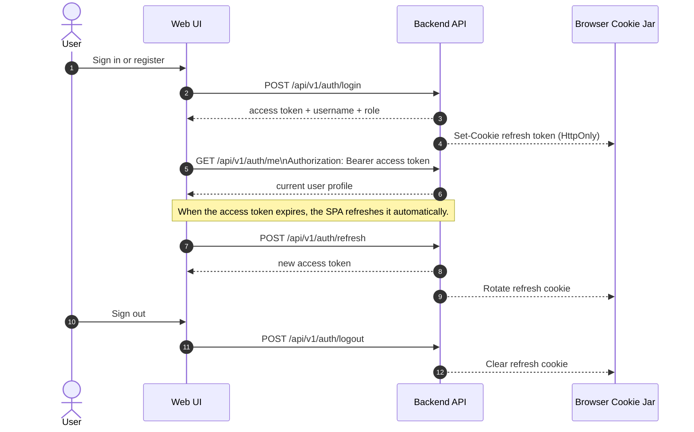

# WeblinkPilot

[](https://github.com/leoyakubov/weblink-pilot/actions/workflows/ci.yml)
[](https://github.com/leoyakubov/weblink-pilot/actions/workflows/smoke-backend.yml)
[](https://github.com/leoyakubov/weblink-pilot/actions/workflows/smoke-frontend.yml)
[](https://app.netlify.com/sites/96caf667-74c1-4b10-829d-f9af82d694d5/deploys)
[](https://dashboard.render.com/)

Modern URL shortening platform with QR codes, separate redirect vs QR analytics, and a mobile-first web UI.

Live demo: Netlify frontend and Render backend with Render Postgres and Render Key Value Redis.

The app supports both anonymous demo links and signed-in user-owned links. Guests can shorten URLs immediately, while authenticated users get owned links, private history, and admin-only monitoring if they have the admin role.
The cleaner SaaS-style landing page keeps the main create flow front and center, while the About page holds product, stack, seeded data, API, and project links.
Local/dev startup also seeds the shared `admin` and `user` accounts plus a small set of starter links so the dashboards are never empty on first run.

## App Pages

| Route              | Purpose                                                                                    |
| ------------------ | ------------------------------------------------------------------------------------------ |
| `/`                | Home page and create-link flow                                                             |
| `/links`           | Links list with filters and quick actions                                                  |
| `/link/:code`      | Link details, QR code, copy/share/open actions, and JSON preview                           |
| `/analytics`       | Analytics overview across visible links                                                    |
| `/analytics/:code` | Per-link analytics detail page                                                             |
| `/account`         | Account profile, password/security actions, and identity provider information              |
| `/about`           | Product, access, seeded data, stack, implementation, API endpoints, and project links      |
| `/monitoring`      | Admin monitoring with health checks, runtime metrics, configuration, and service endpoints |
| `/admin/users`     | Admin read-only users directory                                                            |
| `/settings/reset`  | Browser settings reset utility                                                             |

Auth and recovery routes are available under `/auth/signin`, `/auth/signup`, `/auth/forgot-password`, `/auth/reset-password`, `/auth/verify-email/request`, `/auth/verify-email`, and `/auth/github/complete`.

## Auth Flow



## Docs

- [Documentation Index](docs/README.md)

### Planning & Requirements

- [Product Spec](docs/planning/product-spec.md)
- [Roadmap](docs/planning/roadmap.md)

### Design & Architecture

- [Architecture Plan](docs/design/architecture-plan.md)
- [Backend Module Plan](docs/design/backend-module-plan.md)
- [Frontend Plan](docs/design/frontend-plan.md)
- [Architecture Decisions](docs/design/adr.md)
- [Tech Stack](docs/design/tech-stack.md)
- [Repository Structure](docs/design/repo-structure.md)

### Implementation & Development

- [API Contract v1](docs/implementation/api-contract-v1.md)
- [Development Standards](docs/implementation/development-standards.md)
- [Development Environment](docs/implementation/development-environment.md)
- [Agent Instructions](AGENTS.md)

### Testing & QA

- [Feature Testing Guide](docs/testing/feature-testing.md)
- [Auth Testing Workflow](docs/testing/auth-testing.md)
- [Backend Testing Strategy](docs/testing/backend-testing.md)

### Deployment & Operations

- [Deployment](docs/operations/deployment.md)

### Release & Reference

- [Changelog](CHANGELOG.md)
- [Interview Notes](docs/reference/interview-notes.md)
- [Security Review](docs/reference/security-review.md)

## Repository Structure

- `backend/` - Java modular monolith and infrastructure
- `frontend/` - Vue mobile-first web application
- `docs/` - categorized planning, design, implementation, testing, operations, and reference docs
- `infra/` - Docker, deployment, and local environment tooling

## Backend Quick Start

Requires Java 25. Maven is downloaded automatically by the wrapper on the first run.

From `backend/` on Windows:

```powershell
.\mvnw.cmd -pl application -am clean package -DskipTests
java -jar application\\target\\application-0.1.0-SNAPSHOT.jar
```

On macOS/Linux:

```bash
./mvnw -pl application -am clean package -DskipTests
java -jar application/target/application-0.1.0-SNAPSHOT.jar
```

Useful API endpoints after startup:

- `http://localhost:8080/swagger-ui.html`
- `http://localhost:8080/v3/api-docs`
- `http://localhost:8080/r/{code}`
- `http://localhost:8080/api/v1/urls/{code}/preview`
- `http://localhost:8080/api/v1/urls/{code}/qr`
- `http://localhost:8080/api/v1/analytics/{code}`
- `http://localhost:8080/api/v1/analytics/{code}/count`
- `http://localhost:8080/api/v1/admin/monitoring`
- `http://localhost:8080/api/v1/admin/users`

## Backend Quality

To run the backend verification gate from `backend/`:

```powershell
.\mvnw.cmd -Pci clean verify
```

On macOS/Linux:

```bash
./mvnw -Pci clean verify
```

The HTML report is written to `backend/build-support/target/site/jacoco-aggregate/index.html`.

Helper script:

- [`scripts/quality/backend-coverage.sh`](scripts/quality/backend-coverage.sh)

## Dependency Security

Run the dependency vulnerability checks from the repo root when you want the manual security gate:

```bash
bash ./scripts/security/check-dependencies.sh
```

Backend-only check:

- [`scripts/security/backend-vulnerabilities.sh`](scripts/security/backend-vulnerabilities.sh)

Frontend-only check:

- [`scripts/security/frontend-vulnerabilities.sh`](scripts/security/frontend-vulnerabilities.sh)

## Secret Scanning

Run the repo-wide secret scan from the repo root:

```bash
bash ./scripts/git/scan-secrets.sh
```

The scan uses the official Gitleaks Docker image and the repo-level [`gitleaks`](.gitleaks.toml) configuration.
It scans Git-tracked content, so your local `.env` files stay private to your machine and do not block the repo gate.

## SonarQube / Code Quality

Local SonarQube support is available through the Docker stack in `infra/sonar/`.
GitHub Actions Sonar is currently disabled for now; run Sonar locally with the helper scripts below.

Start it from the repo root:

```bash
bash ./scripts/quality/sonar-stack.sh
```

Then run analysis from `backend/`:

```powershell
$env:SONAR_TOKEN = "<your-token>"
$env:SONAR_HOST_URL = "http://localhost:9001"
.\mvnw.cmd -Pci clean verify sonar:sonar -Dsonar.token=$env:SONAR_TOKEN -Dsonar.host.url=$env:SONAR_HOST_URL
```

On macOS/Linux:

```bash
export SONAR_TOKEN="<your-token>"
export SONAR_HOST_URL="http://localhost:9001"
./mvnw -Pci clean verify sonar:sonar -Dsonar.token="$SONAR_TOKEN" -Dsonar.host.url="$SONAR_HOST_URL"
```

The default local SonarQube UI is available at `http://localhost:9001`.

If you prefer not to type the Maven command manually, use the helper scripts:

- [`scripts/quality/sonar-analysis.sh`](scripts/quality/sonar-analysis.sh)

For a local backend convenience file, copy `backend/.env.example` to `backend/.env` and fill in the values:

```bash
cp backend/.env.example backend/.env
APP_AUTH_JWT_SECRET=your-local-jwt-secret
```

The backend reads `APP_AUTH_JWT_SECRET` first, then `JWT_SECRET`. The local and dev profiles also fall back to a built-in non-blank placeholder if neither variable is set, so local startup does not fail on an empty secret. Demo and production-style runs still require a real secret from the environment.

Deployment, smoke, and Netlify/Render helper values live under `infra/.env`. Use `infra/.env.example` as the starter file.
SonarQube helper values live under `infra/sonar/.env`. Use `infra/sonar/.env.example` as the starter file.

## Run Scripts

The project uses one Bash-only script set on every platform; Windows runs it through WSL. See [`scripts/README.md`](scripts/README.md) for setup and usage.

From the repo root, the preferred quick-run entrypoints are grouped by area:

- Backend local: [`scripts/dev/backend-local.sh`](scripts/dev/backend-local.sh)
- Backend dev only: [`scripts/dev/backend-dev.sh`](scripts/dev/backend-dev.sh)
- Backend format: [`scripts/quality/backend-format.sh`](scripts/quality/backend-format.sh)
- Backend style check: [`scripts/quality/backend-style.sh`](scripts/quality/backend-style.sh)
- Backend tests: [`scripts/quality/backend-tests.sh`](scripts/quality/backend-tests.sh)
- Backend coverage: [`scripts/quality/backend-coverage.sh`](scripts/quality/backend-coverage.sh)
- Backend vulnerability check: [`scripts/security/backend-vulnerabilities.sh`](scripts/security/backend-vulnerabilities.sh)
- Frontend local: [`scripts/dev/frontend-local.sh`](scripts/dev/frontend-local.sh)
- Frontend format: [`scripts/quality/frontend-format.sh`](scripts/quality/frontend-format.sh)
- Frontend style check: [`scripts/quality/frontend-style.sh`](scripts/quality/frontend-style.sh)
- Frontend tests: [`scripts/quality/frontend-tests.sh`](scripts/quality/frontend-tests.sh)
- Frontend vulnerability check: [`scripts/security/frontend-vulnerabilities.sh`](scripts/security/frontend-vulnerabilities.sh)
- Frontend coverage: `npm run test:coverage` from `frontend/`
- Frontend build: [`scripts/dev/frontend-build.sh`](scripts/dev/frontend-build.sh)
- Frontend smoke test: [`scripts/dev/smoke-frontend.sh`](scripts/dev/smoke-frontend.sh)
- Deployment smoke: [`scripts/quality/deployment-smoke.sh`](scripts/quality/deployment-smoke.sh)
- Dependency security: [`scripts/security/check-dependencies.sh`](scripts/security/check-dependencies.sh)
- Secret scanning: [`scripts/git/scan-secrets.sh`](scripts/git/scan-secrets.sh)
- Dev Docker full stack: [`scripts/dev/fullstack-dev.sh`](scripts/dev/fullstack-dev.sh)
- Dev monitoring stack: [`scripts/dev/monitoring-stack.sh`](scripts/dev/monitoring-stack.sh)
- Demo-like local stack: [`scripts/dev/fullstack-demo-local.sh`](scripts/dev/fullstack-demo-local.sh)
- Demo-like local stop: [`scripts/dev/fullstack-demo-local-stop.sh`](scripts/dev/fullstack-demo-local-stop.sh)
- Backend demo mode: [`scripts/dev/backend-demo-local.sh`](scripts/dev/backend-demo-local.sh)
- Frontend demo preview: [`scripts/dev/frontend-demo-local.sh`](scripts/dev/frontend-demo-local.sh)
- SonarQube stack: [`scripts/quality/sonar-stack.sh`](scripts/quality/sonar-stack.sh)
- Sonar analysis: [`scripts/quality/sonar-analysis.sh`](scripts/quality/sonar-analysis.sh)
- Git hook setup: [`scripts/git/setup-hooks.sh`](scripts/git/setup-hooks.sh)

## Local, Demo, and Dev Modes

- `local`: use the full Docker stack or the backend-local launcher. Mailpit is the inbox catcher.
- `demo`: use the demo-local launcher to mimic Render more closely. The backend runs in `demo` profile and the frontend opens preview links in the simulated mailbox modal.
- `dev`: use the backend-only or frontend-local scripts when you want to run pieces independently during development.

Quick commands:

- Local stack: [`scripts/dev/fullstack-dev.sh`](scripts/dev/fullstack-dev.sh)
- Demo-like stack: [`scripts/dev/fullstack-demo-local.sh`](scripts/dev/fullstack-demo-local.sh)
- Demo-like stop: [`scripts/dev/fullstack-demo-local-stop.sh`](scripts/dev/fullstack-demo-local-stop.sh)
- Backend demo mode: [`scripts/dev/backend-demo-local.sh`](scripts/dev/backend-demo-local.sh)
- Frontend demo preview: [`scripts/dev/frontend-demo-local.sh`](scripts/dev/frontend-demo-local.sh)
- Backend local with Mailpit: [`scripts/dev/backend-local.sh`](scripts/dev/backend-local.sh)
- Frontend local: [`scripts/dev/frontend-local.sh`](scripts/dev/frontend-local.sh)
- Git hook setup: [`scripts/git/setup-hooks.sh`](scripts/git/setup-hooks.sh)
- Before-push check: [`scripts/run-before-push.sh`](scripts/run-before-push.sh)

The project has one Bash-only script set. On Windows, run it through WSL, for example:

```powershell
wsl bash ./scripts/run-before-push.sh
```

To disable the pre-push hook in the current clone, run:

```powershell
git config --unset core.hooksPath
```

To enable it again:

```bash
bash ./scripts/git/setup-hooks.sh
```

The scripts under `scripts/` are the canonical local and CI entrypoints.

Note: stop any already running backend instance before starting dev mode, otherwise port `8080` will already be in use.

If you want the exact test/build shortcuts the project uses day to day:

- Frontend tests: [`scripts/quality/frontend-tests.sh`](scripts/quality/frontend-tests.sh)
- Backend coverage: [`scripts/quality/backend-coverage.sh`](scripts/quality/backend-coverage.sh)
- Frontend build: [`scripts/dev/frontend-build.sh`](scripts/dev/frontend-build.sh)
- Frontend coverage: `npm run test:coverage` from `frontend/`
- Frontend smoke test: [`scripts/dev/smoke-frontend.sh`](scripts/dev/smoke-frontend.sh)

## Docker Stack

The repo also includes a containerized local stack:

- [`infra/docker-compose.yml`](infra/docker-compose.yml)
- backend image built from [`backend/Dockerfile`](backend/Dockerfile)
- frontend image built from [`frontend/Dockerfile`](frontend/Dockerfile)
- Postgres 17 for persistence
- Redis 7 for hot-cache lookups and analytics cache invalidation
- Prometheus and Grafana are available in a separate monitoring stack

Start it from the repo root:

```bash
docker compose -p weblink-pilot -f infra/docker-compose.yml up --build
```

Services:

- frontend: `http://localhost:8081`
- backend API: `http://localhost:8080/api/v1`
- backend direct: `http://localhost:8080`
- Mailpit: `http://localhost:8025`

Start monitoring separately when you need it:

```bash
docker compose -p weblink-pilot-monitoring -f infra/monitoring/docker-compose.monitoring.yml up --build
```

Monitoring services:

- Prometheus: `http://localhost:9090`
- Grafana: `http://localhost:3001`

The frontend container serves the Vue app through nginx and proxies API and redirect requests to the backend. The Docker stack uses the `dev` Spring profile with PostgreSQL and Redis so it behaves like a production-shaped local stack, while direct local development still uses the `local` profile with in-memory H2.
The admin monitoring page reads `/api/v1/admin/monitoring` for health checks, runtime metrics, configuration, and service endpoints. When the optional local monitoring stack is running, the same page links to Prometheus and Grafana.

### Backend Profiles

- `local`: default for developer workflows, uses H2 and localhost origins
- `dev`: Docker stack profile, uses PostgreSQL, Redis, and localhost deployment wiring
- `demo`: use for deployed demo instances, uses PostgreSQL, Redis, and runtime secrets
- `ci`: verification profile for automated builds, tests, coverage, and static analysis

When running `local`, the H2 console is available at `http://localhost:8080/h2-console`.

You can also select the Maven convenience profiles when running the backend directly:

```powershell
.\mvnw.cmd -Plocal -pl application -am spring-boot:run
.\mvnw.cmd -Pdev -pl application -am spring-boot:run
.\mvnw.cmd -Pdemo -pl application -am spring-boot:run
```

Quick guide:

- `local`: [`scripts/dev/backend-local.sh`](scripts/dev/backend-local.sh)
- `dev`: [`scripts/dev/fullstack-dev.sh`](scripts/dev/fullstack-dev.sh) for the main stack, [`scripts/dev/monitoring-stack.sh`](scripts/dev/monitoring-stack.sh) for dashboards, or [`scripts/dev/backend-dev.sh`](scripts/dev/backend-dev.sh) after Postgres and Redis are up locally
- `demo`: Render backend + Netlify frontend

For a lightweight browser smoke check against the Docker stack, use:

- [`scripts/dev/smoke-frontend.sh`](scripts/dev/smoke-frontend.sh)

It expects the Docker stack to be up and a local Chrome or Edge executable to be available, or `PLAYWRIGHT_BROWSER_PATH` to be set.

For a local smoke check, the script defaults to the Docker stack URLs:

- backend: `http://localhost:8080/actuator/health`
- frontend: `http://localhost:8081`

To smoke the live demo instead, set `SMOKE_TARGET=demo` and provide `RENDER_HEALTH_URL` and `FRONTEND_SMOKE_URL` in your shell or in `infra/.env`.

Then run:

```bash
bash ./scripts/quality/deployment-smoke.sh
```

## Frontend Quick Start

Requires Node.js 24.16.0 LTS and npm 11.13.0.

From `frontend/`:

```bash
npm install
npm run dev
```

The app expects the backend at `http://localhost:8080/api/v1` by default. You can override that with a local `.env` file:

```bash
VITE_API_BASE_URL=http://localhost:8080/api/v1
```

Default local/dev credentials for the current backend:

- `admin / admin123`
- `user / user123`

Demo deployments can seed the same accounts through the `BOOTSTRAP_*` environment variables listed in the deployment docs.

Guest mode does not require signing in and is the fastest way to create a demo link.
