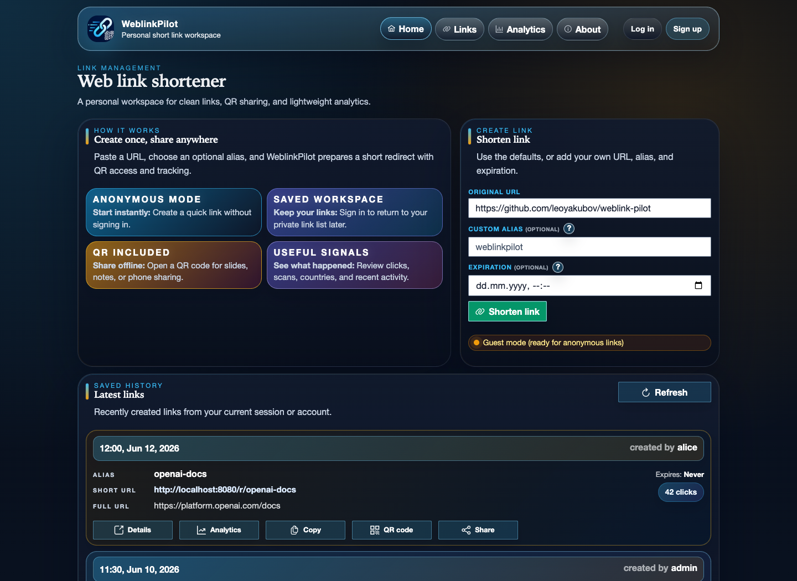
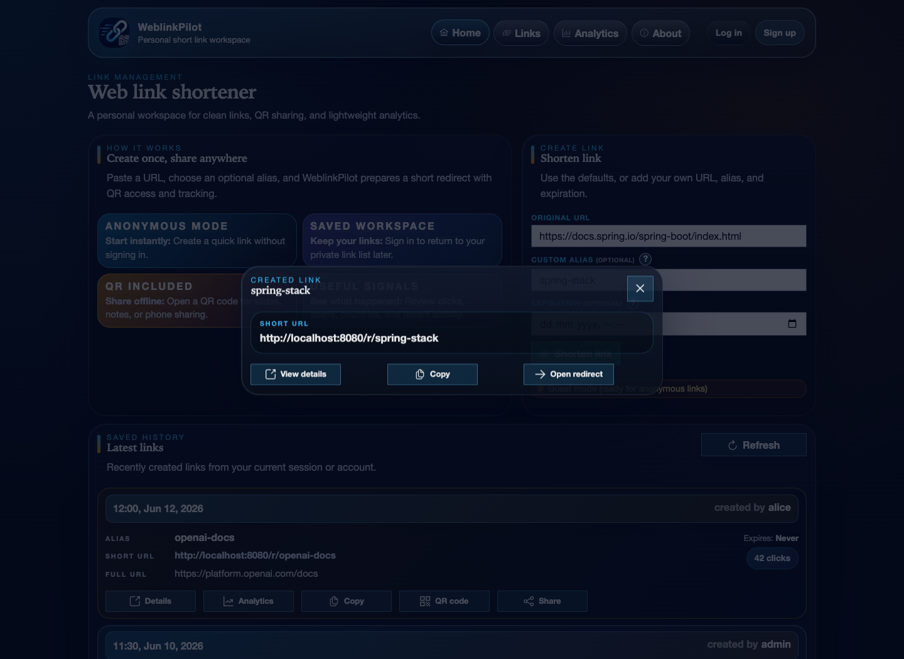
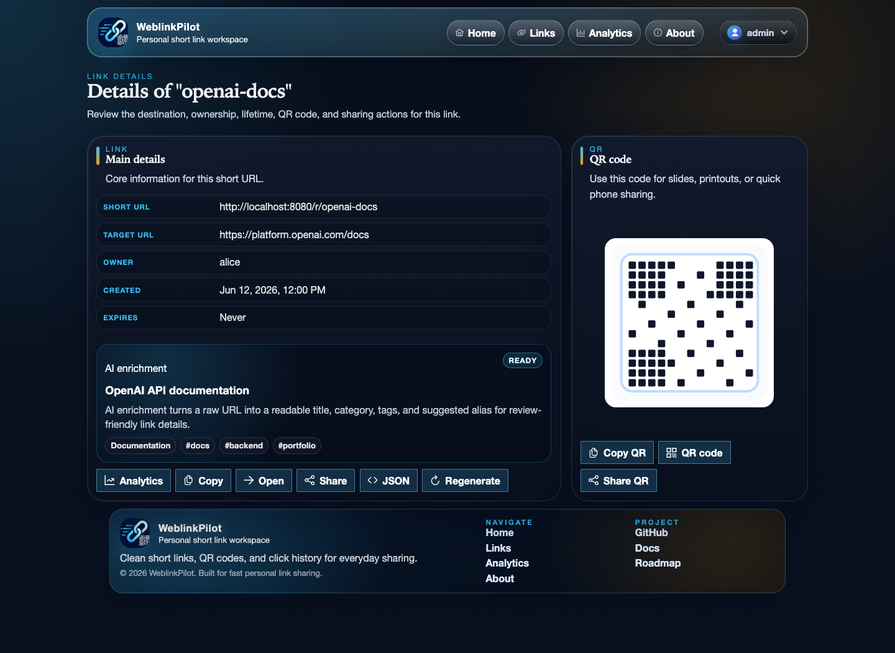
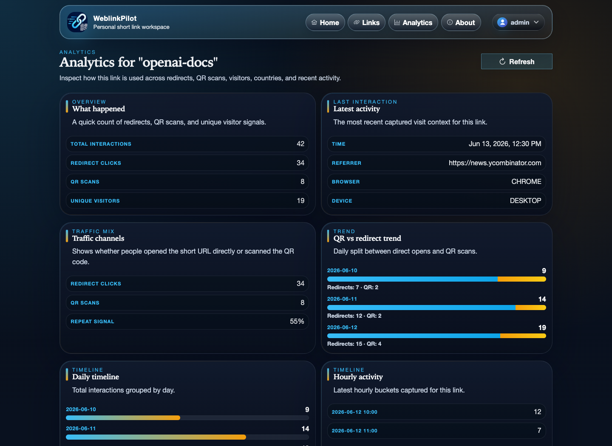
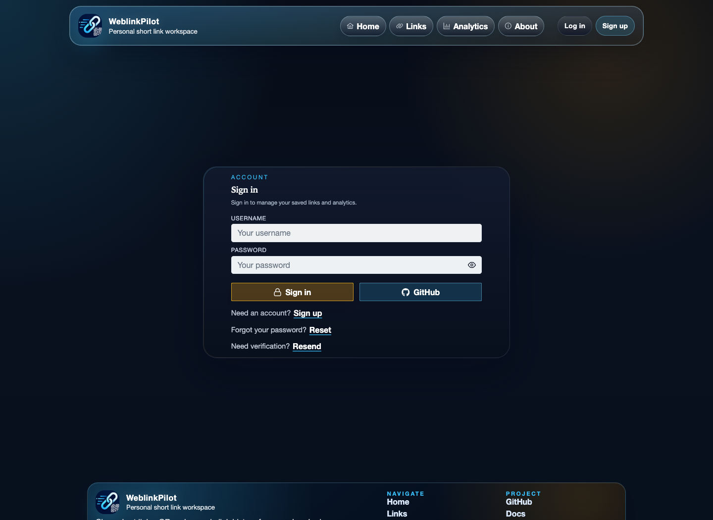
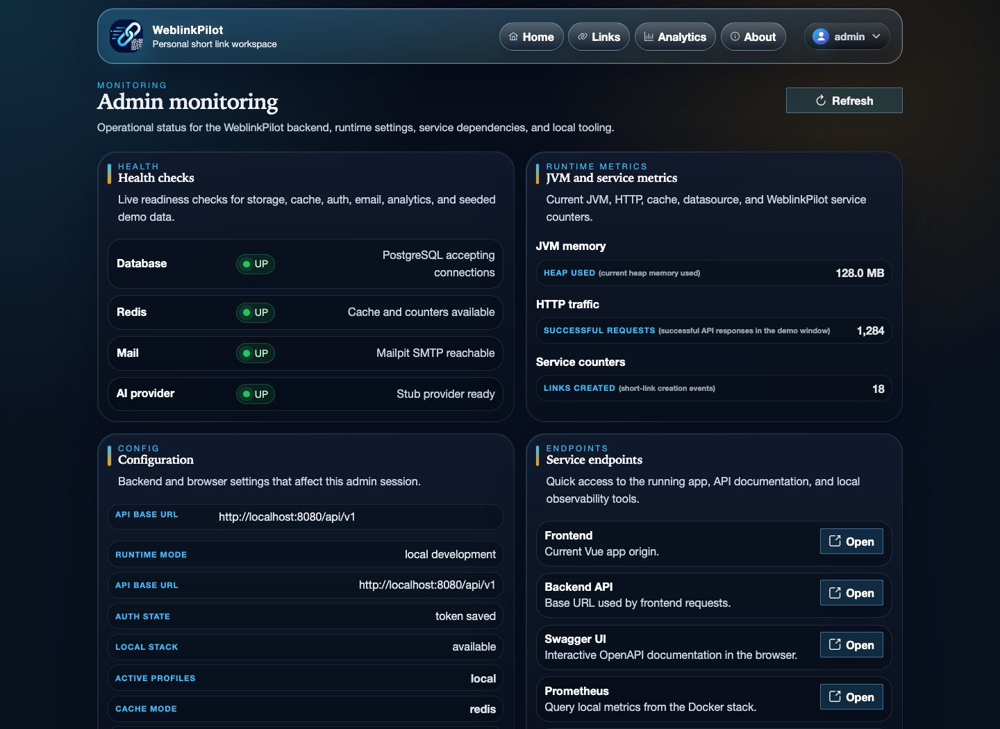
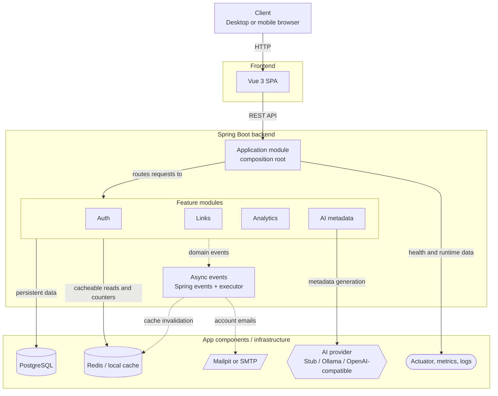

# WeblinkPilot

<p align="center">
  
</p>

<p align="center">
  Production-shaped URL shortener with AI metadata enrichment, built with Java, Spring Boot, Vue 3, PostgreSQL, Redis, Thymeleaf, and Docker.
</p>

<p align="center">
  <a href="https://github.com/leoyakubov/weblink-pilot/actions/workflows/ci.yml">
    
  </a>
  <a href="https://github.com/leoyakubov/weblink-pilot/actions/workflows/smoke-backend.yml">
    
  </a>
  <a href="https://github.com/leoyakubov/weblink-pilot/actions/workflows/smoke-frontend.yml">
    
  </a>
  <a href="https://app.netlify.com/sites/96caf667-74c1-4b10-829d-f9af82d694d5/deploys">
    
  </a>
  <a href="https://dashboard.render.com/">
    
  </a>
</p>

<p align="center">
  
  
  
  
  
  
  
</p>

WeblinkPilot is a URL shortener for creating, sharing, and tracking short links. It combines fast redirects, QR generation, click analytics, authentication, admin monitoring, and AI metadata enrichment that classifies links and generates readable titles, summaries, tags, icons, and suggested aliases.

The repo is organized as a monorepo so the backend, frontend, docs, infra, and scripts stay in one place and move together.

## Table of Contents

- [Live Demo](#live-demo)
- [Preview](#preview)
- [Project Scope](#project-scope)
- [What Is Implemented](#what-is-implemented)
- [Roadmap](#roadmap)
- [Architecture](#architecture)
- [Tech Stack](#tech-stack)
- [Run Locally](#run-locally)
- [Demo Walkthrough](#demo-walkthrough)
- [Quality Gates](#quality-gates)
- [Key Pages](#key-pages)
- [API Overview](#api-overview)
- [Docs](#docs)
- [Repository Structure](#repository-structure)
- [Key Terms](#key-terms)
- [Backend-Only Quick Start](#backend-only-quick-start)
- [Limitations And Production Notes](#limitations-and-production-notes)
- [Troubleshooting](#troubleshooting)
- [Interview Talking Points](#interview-talking-points)

## Live Demo

Open the deployed frontend here: [weblink-pilot.netlify.app](https://weblink-pilot.netlify.app)

The demo frontend is configured to use the Render backend at `https://weblink-pilot.onrender.com`.
Render free plans can sleep after inactivity, so backend requests may take extra time or require a retry while the service wakes up.
For reliable API exploration, run the project locally and open Swagger UI at `http://localhost:8080/swagger-ui.html`.

## Preview

Screenshots are generated from the Vue app with deterministic mocked API data:

```bash
npm --prefix frontend run screenshots
```

| Home                                                                                     | Link created                                                                                             |
| ---------------------------------------------------------------------------------------- | -------------------------------------------------------------------------------------------------------- |
|  |  |

| Link details                                                                              | Analytics                                                                                                    |
| ----------------------------------------------------------------------------------------- | ------------------------------------------------------------------------------------------------------------ |
|  |  |

| Authentication                                                                          | Admin monitoring                                                                                     |
| --------------------------------------------------------------------------------------- | ---------------------------------------------------------------------------------------------------- |
|  |  |

## Project Scope

- Modular Spring Boot backend with clear auth, links, analytics, and AI metadata boundaries.
- Backend module boundaries are designed so heavily used features can be extracted into microservices later if scale or team ownership requires it.
- Redis cache-aside redirect flow for frequently used short codes.
- Asynchronous click analytics so redirects can stay focused on fast resolution.
- JWT-based authentication with user and admin roles.
- Vue 3 frontend with dedicated pages for links, analytics, account, and monitoring.
- Dockerized local and demo environments for repeatable review.
- Documentation for architecture, API behavior, testing, deployment, and roadmap decisions.

## What Is Implemented

- Anonymous and signed-in short-link creation with random codes or custom aliases.
- Link expiration, archived expired codes, and reserved short-code behavior.
- QR generation for mobile sharing and QR-specific redirect analytics.
- Redis-backed cache-aside redirect lookup for hot short codes.
- Click analytics with browser, device, referrer, country, and event-source context.
- Paginated home latest links, links history, analytics overview, and admin users pages.
- JWT access tokens plus HttpOnly refresh-cookie rotation.
- Registration, login, logout, account profile, password change, password reset, and email verification.
- GitHub OAuth login completion flow.
- Thymeleaf text templates for account notification emails.
- AI metadata enrichment with stub, Ollama, or OpenAI-compatible providers.
- Admin monitoring for health, runtime metrics, configuration, service links, and users.
- Dockerized local/dev/demo stacks, deployment smoke checks, coverage gates, and secret/dependency scans.

## Roadmap

The full planning source of truth lives in the [Roadmap](docs/planning/roadmap.md).

Near-term focus:

- Keep the README, screenshots, and docs aligned with the shipped UI and API.
- Continue polishing auth, links, analytics, and deployment smoke coverage.
- Keep email template maintenance simple as account flows evolve.
- Revisit broker-backed async messaging and expiry reminder emails only if product scope requires them.

## Architecture



Solid arrows show request-time interactions.

Dotted arrows show asynchronous event-driven work handled by Spring events and the application async executor.

Async events cover account emails, click analytics, AI enrichment, and cache invalidation.

Backend modules share contracts and event types through the `shared` module.

PostgreSQL is the durable store.

Redis/local cache is the fast path for cacheable reads and counters.

SMTP/Mailpit handles account emails.

Actuator, metrics, and logs expose runtime visibility.

## Tech Stack

- Java 21
- Spring Boot
- Vue 3
- PostgreSQL
- Redis
- Thymeleaf email templates
- Docker and Docker Compose
- JWT authentication
- Testcontainers
- OpenAPI
- Flyway

## Run Locally

See [Development Environment](docs/implementation/development-environment.md) for the full setup.

Fast path after cloning:

1. Install Java 21, Node.js 24 LTS (`24.16.0`), npm 11 (`11.13.0`), and Docker.
2. Copy local env files if you need overrides: `cp backend/.env.example backend/.env` and `cp frontend/.env.example frontend/.env`.
3. Put a local JWT secret in `backend/.env`, for example `JWT_SECRET=change-me-to-a-long-local-secret`.
4. Start the full local Docker stack:

```bash
bash ./scripts/dev/fullstack-dev.sh
```

5. Open the frontend at `http://localhost:8081`.
6. Open Swagger UI at `http://localhost:8080/swagger-ui.html`.
7. Open Mailpit at `http://localhost:8025` for verification and reset emails.
8. Sign in with seeded credentials if you want owned links or admin pages:

| Role  | Username | Password   |
| ----- | -------- | ---------- |
| Admin | `admin`  | `admin123` |
| User  | `user`   | `user123`  |

Common helper scripts:

```bash
bash ./scripts/dev/fullstack-dev.sh
bash ./scripts/run-before-push.sh
bash ./scripts/quality/deployment-smoke.sh
```

## Demo Walkthrough

Use these scenarios for a quick product walkthrough before a demo or release check.
For a deeper manual QA guide, see the [Feature Testing Guide](docs/testing/feature-testing.md).

| Scenario         | Steps                                                                                                     | Expected result                                                                                  |
| ---------------- | --------------------------------------------------------------------------------------------------------- | ------------------------------------------------------------------------------------------------ |
| Guest link       | Open `/`, keep the default URL or enter a target, click `Shorten link`, then open the generated short URL | A short link is created anonymously, redirects to the target, and appears in latest links        |
| Signed-in links  | Sign in as `user / user123`, create a link, open `/links`, then open the link details page                | The link is owned by `user`, available in the filtered list, and exposes QR/copy/share actions   |
| Analytics        | Open a seeded link such as `/r/redis`, scan/open its QR path, then open `/analytics/redis`                | Redirect and QR counts update, recent interactions show event context, and breakdown panels load |
| Admin operations | Sign in as `admin / admin123`, open `/monitoring`, then open `Users` from the account menu                | Admin can inspect health, metrics, configuration, endpoints, and the read-only users directory   |
| Account recovery | Register a new account, verify it through Mailpit locally, then request password reset                    | Verification and reset emails arrive, one-time links work, and no secret token appears in logs   |

## Quality Gates

Backend verification:

```bash
./mvnw -Pci clean verify
```

Frontend and repo-wide checks:

```bash
bash ./scripts/run-before-push.sh
```

Security scans:

```bash
bash ./scripts/security/check-dependencies.sh
bash ./scripts/git/scan-secrets.sh
```

Expected verification results:

- Maven ends with `BUILD SUCCESS`.
- Backend unit/integration tests and coverage checks pass through the `ci` profile.
- Frontend lint, Vitest, e2e smoke, and production build pass through `bash ./scripts/run-before-push.sh fe`.
- Deployment smoke prints backend HTTP status with `status=UP` and confirms the frontend app shell marker.
- Dependency and secret scans finish without high-severity dependency findings or committed secrets.

The HTML coverage report is written to `backend/build-support/target/site/jacoco-aggregate/index.html`.

## Key Pages

| Route              | Purpose                                                                                    |
| ------------------ | ------------------------------------------------------------------------------------------ |
| `/`                | Home page and create-link flow                                                             |
| `/links`           | Links list with filters and quick actions                                                  |
| `/link/:code`      | Link details, QR code, copy/share/open actions, and JSON preview                           |
| `/analytics`       | Analytics overview across visible links                                                    |
| `/analytics/:code` | Per-link analytics detail page                                                             |
| `/account`         | Account profile, password/security actions, and identity provider information              |
| `/about`           | Product, access, seeded data, stack, implementation, API endpoints, and project links      |
| `/monitoring`      | Admin monitoring with health checks, runtime metrics, configuration, and service endpoints |
| `/admin/users`     | Admin read-only users directory                                                            |
| `/settings/reset`  | Browser settings reset utility                                                             |

Auth and recovery routes live under `/auth/signin`, `/auth/signup`, `/auth/forgot-password`, `/auth/reset-password`, `/auth/verify-email/request`, `/auth/verify-email`, and `/auth/github/complete`.

## API Overview

The full API contract lives in [API Contract v1](docs/implementation/api-contract-v1.md). These are the endpoints most useful for a quick review:

| Method | Path                                 | Purpose                                                | Auth                  |
| ------ | ------------------------------------ | ------------------------------------------------------ | --------------------- |
| `POST` | `/api/v1/urls`                       | Create a short link with optional alias and expiration | Public or signed-in   |
| `GET`  | `/api/v1/urls?page=0&size=10`        | List visible links with pagination metadata            | Public or signed-in   |
| `GET`  | `/api/v1/urls/{code}`                | Read link details                                      | Public or owner-aware |
| `GET`  | `/api/v1/urls/{code}/qr`             | Return PNG QR code for the short URL                   | Public                |
| `GET`  | `/r/{code}`                          | Resolve and redirect a short link                      | Public                |
| `GET`  | `/q/{code}`                          | QR redirect path that records QR event source          | Public                |
| `GET`  | `/api/v1/analytics/{code}`           | Read per-link analytics summary                        | Public or owner-aware |
| `POST` | `/api/v1/auth/login`                 | Sign in and set refresh cookie                         | Public                |
| `POST` | `/api/v1/auth/refresh`               | Rotate refresh token and return a new access token     | Refresh cookie        |
| `GET`  | `/api/v1/auth/account`               | Read account profile and identity provider info        | User                  |
| `GET`  | `/api/v1/admin/monitoring`           | Read admin monitoring snapshot                         | Admin                 |
| `GET`  | `/api/v1/admin/users?page=0&size=10` | Read paginated users directory                         | Admin                 |

## Docs

Start with the [Documentation Index](docs/README.md).

### Planning & Requirements

- [Product Spec](docs/planning/product-spec.md)
- [Roadmap](docs/planning/roadmap.md)

### Design & Architecture

- [Architecture Plan](docs/design/architecture-plan.md)
- [Backend Module Plan](docs/design/backend-module-plan.md)
- [Frontend Plan](docs/design/frontend-plan.md)
- [Architecture Decisions](docs/design/adr.md)
- [Tech Stack](docs/design/tech-stack.md)
- [Repository Structure](docs/design/repo-structure.md)

### Implementation & Development

- [API Contract v1](docs/implementation/api-contract-v1.md)
- [Email Templates](docs/implementation/email-templates.md)
- [Development Standards](docs/implementation/development-standards.md)
- [Development Environment](docs/implementation/development-environment.md)
- [Agent Instructions](AGENTS.md)

### Testing & QA

- [Feature Testing Guide](docs/testing/feature-testing.md)
- [Auth Testing Workflow](docs/testing/auth-testing.md)
- [Backend Testing Strategy](docs/testing/backend-testing.md)

### Deployment & Operations

- [Deployment](docs/operations/deployment.md)

### Release & Reference

- [Changelog](CHANGELOG.md)
- [Interview Notes](docs/reference/interview-notes.md)
- [Security Review](docs/reference/security-review.md)
- [GitHub Presentation Checklist](docs/reference/github-presentation.md)

## Repository Structure

- `backend/` - Java modular monolith and infrastructure
- `frontend/` - Vue mobile-first web application
- `docs/` - planning, design, implementation, testing, operations, and reference docs
- `infra/` - Docker, deployment, and local environment tooling
- `scripts/` - repo automation for dev, quality, and security tasks

## Key Terms

- **Short code**: the compact identifier used in `/r/{code}` and `/q/{code}`.
- **Cache-aside**: the redirect path checks Redis first and falls back to PostgreSQL when the cache misses.
- **Modular monolith**: one deployable Spring Boot backend split into explicit feature modules.
- **Feature module**: a backend business boundary such as `auth`, `links`, `analytics`, or `ai`.
- **Shared contracts**: DTOs, events, ports, and shared types used to keep module boundaries stable.
- **Domain event**: an internal Spring event used when the producer should not know or wait for the consumer.
- **Async analytics**: click events are published outside the redirect response path so redirects stay fast.
- **AI metadata enrichment**: background generation of title, summary, category, tags, and icon metadata for created links.
- **Refresh cookie**: an HttpOnly cookie that stores the refresh token while the access token stays short-lived.

## Backend-Only Quick Start

Requires Java 21. Maven is downloaded automatically by the wrapper on the first run.

From `backend/` on Windows:

```powershell
.\mvnw.cmd -pl application -am clean package -DskipTests
java -jar application\target\application-0.1.0-SNAPSHOT.jar
```

On macOS/Linux:

```bash
./mvnw -pl application -am clean package -DskipTests
java -jar application/target/application-0.1.0-SNAPSHOT.jar
```

Useful API endpoints after startup:

- `http://localhost:8080/swagger-ui.html`
- `http://localhost:8080/v3/api-docs`
- `http://localhost:8080/r/{code}`
- `http://localhost:8080/api/v1/urls/{code}/preview`
- `http://localhost:8080/api/v1/urls/{code}/qr`
- `http://localhost:8080/api/v1/analytics/{code}`
- `http://localhost:8080/api/v1/analytics/{code}/count`
- `http://localhost:8080/api/v1/admin/monitoring`
- `http://localhost:8080/api/v1/admin/users`

## Limitations And Production Notes

This is a production-shaped portfolio project, not a multi-tenant commercial SaaS.

Current boundaries:

- Redis is a performance layer; PostgreSQL remains the durable source of truth.
- Internal Spring events are used instead of RabbitMQ/Kafka until broker-backed queues are justified.
- SMTP delivery is asynchronous, but automatic retry/backoff is intentionally simple for the current scope.
- AI enrichment defaults to safe stub/local-provider behavior unless an external provider is explicitly configured.
- QR output is PNG today; SVG/vector output is a future enhancement.
- Team accounts, branded domains, API keys, exports, and webhooks are future product extensions.
- Demo secrets, SMTP credentials, OAuth credentials, and provider keys must stay in environment variables or managed secrets.

Security posture:

- Backend authorization is the real security boundary; frontend routes are only UX boundaries.
- Refresh tokens are stored in an HttpOnly cookie and access tokens are short-lived.
- Reset and verification tokens are not logged in normal operational output and are stored as hashes.
- Demo/public observability keeps health/info public while metrics/prometheus require admin access by default.
- See [Security Review](docs/reference/security-review.md) for the deeper risk register and mitigations.

## Troubleshooting

- If `8080`, `8081`, `5432`, `6379`, or `8025` is already in use, stop the old local process or Docker container and restart the dev stack.
- If the frontend cannot reach the backend, check `VITE_API_BASE_URL` and use `/settings/reset` to clear stale browser settings.
- If password reset or verification emails do not arrive locally, open Mailpit at `http://localhost:8025` and confirm the Mailpit container is running.
- If Redis or PostgreSQL errors appear during the dev stack, restart Docker and rerun `bash ./scripts/dev/fullstack-dev.sh`.
- If frontend dependencies behave strangely across Windows, WSL, and macOS, reinstall `frontend/node_modules` from the same shell you use to run the app.
- If e2e tests cannot launch a browser in WSL, use the repo scripts, which can drive the configured system browser path.
- If the live demo responds slowly at first, wait a few seconds and retry because Render free services can cold start after inactivity.
- If admin pages redirect to home, sign in as `admin / admin123` or verify your account has the `ADMIN` role.

## Interview Talking Points

- Modular monolith keeps delivery velocity high while preserving extraction paths.
- Random short codes improve unpredictability for default links.
- Cache-aside lookup keeps redirects fast.
- Analytics is asynchronous so redirect latency stays low.
- The project can later split analytics into a separate service if scale demands it.

For shorter prep notes, see [Interview Notes](docs/reference/interview-notes.md).
