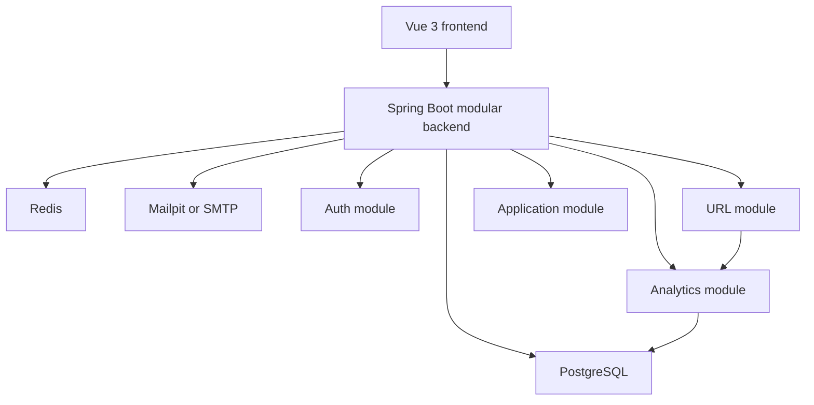

# WeblinkPilot

<p align="center">
  
</p>

<p align="center">
  Production-shaped URL shortener built with Java, Spring Boot, Vue 3, PostgreSQL, Redis, Thymeleaf, and Docker.
</p>

<p align="center">
  <a href="https://github.com/leoyakubov/weblink-pilot/actions/workflows/ci.yml">
    
  </a>
  <a href="https://github.com/leoyakubov/weblink-pilot/actions/workflows/smoke-backend.yml">
    
  </a>
  <a href="https://github.com/leoyakubov/weblink-pilot/actions/workflows/smoke-frontend.yml">
    
  </a>
  <a href="https://app.netlify.com/sites/96caf667-74c1-4b10-829d-f9af82d694d5/deploys">
    
  </a>
  <a href="https://dashboard.render.com/">
    
  </a>
</p>

WeblinkPilot is a portfolio-ready URL shortener that aims to feel like a real product rather than a toy demo. It combines fast redirects, QR generation, analytics, authentication, admin monitoring, and a modular backend architecture that is easy to discuss in interviews.

The repo is organized as a monorepo so the backend, frontend, docs, infra, and scripts stay in one place and move together.

## Why This Project Stands Out

- Production-shaped backend architecture instead of a single flat Spring app.
- Redirect path optimized with Redis cache-aside behavior.
- Analytics captured separately from redirects so latency stays low.
- JWT auth with user and admin roles.
- Mobile-first Vue UI with dedicated pages for links, analytics, account, and monitoring.
- Dockerized local and demo environments for easy review.
- Documentation that explains not only how it works, but why choices were made.

## Highlights

- Create short links with random codes or custom aliases.
- Set expiration for links when needed.
- Generate QR codes for quick mobile sharing.
- Track redirect clicks and QR scans.
- Inspect link details, history, and analytics from the UI.
- Use signed-in ownership for saved links and private history.
- Access admin monitoring for health, runtime metrics, and configuration.
- Run the project locally or through Dockerized demo stacks.

## Architecture



## Key Pages

| Route | Purpose |
| --- | --- |
| `/` | Home page and create-link flow |
| `/links` | Links list with filters and quick actions |
| `/link/:code` | Link details, QR code, copy/share/open actions, and JSON preview |
| `/analytics` | Analytics overview across visible links |
| `/analytics/:code` | Per-link analytics detail page |
| `/account` | Account profile, password/security actions, and identity provider information |
| `/about` | Product, access, seeded data, stack, implementation, API endpoints, and project links |
| `/monitoring` | Admin monitoring with health checks, runtime metrics, configuration, and service endpoints |
| `/admin/users` | Admin read-only users directory |
| `/settings/reset` | Browser settings reset utility |

Auth and recovery routes live under `/auth/signin`, `/auth/signup`, `/auth/forgot-password`, `/auth/reset-password`, `/auth/verify-email/request`, `/auth/verify-email`, and `/auth/github/complete`.

## Screenshots

Use a small, curated set of screenshots so the repo reads like a product page instead of a code dump.

### Home


### Link created


### Link details


### Analytics


### Authentication


### Admin monitoring


## Demo Scenarios

Use these scenarios for a quick product walkthrough before a demo or release check.
For a deeper manual QA guide, see the [Feature Testing Guide](docs/testing/feature-testing.md).

| Scenario | Steps | Expected result |
| --- | --- | --- |
| Guest link | Open `/`, keep the default URL or enter a target, click `Shorten link`, then open the generated short URL | A short link is created anonymously, redirects to the target, and appears in latest links |
| Signed-in links | Sign in as `user / user123`, create a link, open `/links`, then open the link details page | The link is owned by `user`, available in the filtered list, and exposes QR/copy/share actions |
| Analytics | Open a seeded link such as `/r/redis`, scan/open its QR path, then open `/analytics/redis` | Redirect and QR counts update, recent interactions show event context, and breakdown panels load |
| Admin operations | Sign in as `admin / admin123`, open `/monitoring`, then open `Users` from the account menu | Admin can inspect health, metrics, configuration, endpoints, and the read-only users directory |
| Account recovery | Register a new account, verify it through Mailpit locally, then request password reset | Verification and reset emails arrive, one-time links work, and no secret token appears in logs |

## Tech Stack

- Java 25
- Spring Boot
- Vue 3
- PostgreSQL
- Redis
- Thymeleaf email templates
- Docker and Docker Compose
- JWT authentication
- Testcontainers
- OpenAPI
- Flyway

## Docs

Start with the [Documentation Index](docs/README.md).

### Planning & Requirements

- [Product Spec](docs/planning/product-spec.md)
- [Roadmap](docs/planning/roadmap.md)

### Design & Architecture

- [Architecture Plan](docs/design/architecture-plan.md)
- [Backend Module Plan](docs/design/backend-module-plan.md)
- [Frontend Plan](docs/design/frontend-plan.md)
- [Architecture Decisions](docs/design/adr.md)
- [Tech Stack](docs/design/tech-stack.md)
- [Repository Structure](docs/design/repo-structure.md)

### Implementation & Development

- [API Contract v1](docs/implementation/api-contract-v1.md)
- [Email Templates](docs/implementation/email-templates.md)
- [Development Standards](docs/implementation/development-standards.md)
- [Development Environment](docs/implementation/development-environment.md)
- [Agent Instructions](AGENTS.md)

### Testing & QA

- [Feature Testing Guide](docs/testing/feature-testing.md)
- [Auth Testing Workflow](docs/testing/auth-testing.md)
- [Backend Testing Strategy](docs/testing/backend-testing.md)

### Deployment & Operations

- [Deployment](docs/operations/deployment.md)

### Release & Reference

- [Changelog](CHANGELOG.md)
- [Interview Notes](docs/reference/interview-notes.md)
- [Security Review](docs/reference/security-review.md)
- [GitHub Presentation Checklist](docs/reference/github-presentation.md)

## Repository Structure

- `backend/` - Java modular monolith and infrastructure
- `frontend/` - Vue mobile-first web application
- `docs/` - planning, design, implementation, testing, operations, and reference docs
- `infra/` - Docker, deployment, and local environment tooling
- `scripts/` - repo automation for dev, quality, and security tasks

## Local Development

See [Development Environment](docs/implementation/development-environment.md) for the full setup.

Most commonly used helper scripts:

```bash
bash ./scripts/dev/fullstack-dev.sh
bash ./scripts/run-before-push.sh
bash ./scripts/quality/deployment-smoke.sh
```

## Backend Quick Start

Requires Java 25. Maven is downloaded automatically by the wrapper on the first run.

From `backend/` on Windows:

```powershell
.\mvnw.cmd -pl application -am clean package -DskipTests
java -jar application\target\application-0.1.0-SNAPSHOT.jar
```

On macOS/Linux:

```bash
./mvnw -pl application -am clean package -DskipTests
java -jar application/target/application-0.1.0-SNAPSHOT.jar
```

Useful API endpoints after startup:

- `http://localhost:8080/swagger-ui.html`
- `http://localhost:8080/v3/api-docs`
- `http://localhost:8080/r/{code}`
- `http://localhost:8080/api/v1/urls/{code}/preview`
- `http://localhost:8080/api/v1/urls/{code}/qr`
- `http://localhost:8080/api/v1/analytics/{code}`
- `http://localhost:8080/api/v1/analytics/{code}/count`
- `http://localhost:8080/api/v1/admin/monitoring`
- `http://localhost:8080/api/v1/admin/users`

## Quality Gates

Backend verification:

```bash
./mvnw -Pci clean verify
```

Frontend and repo-wide checks:

```bash
bash ./scripts/run-before-push.sh
```

Security scans:

```bash
bash ./scripts/security/check-dependencies.sh
bash ./scripts/git/scan-secrets.sh
```

The HTML coverage report is written to `backend/build-support/target/site/jacoco-aggregate/index.html`.

## Interview Talking Points

- Modular monolith keeps delivery velocity high while preserving extraction paths.
- Random short codes improve unpredictability for default links.
- Cache-aside lookup keeps redirects fast.
- Analytics is asynchronous so redirect latency stays low.
- The project can later split analytics into a separate service if scale demands it.

For shorter prep notes, see [Interview Notes](docs/reference/interview-notes.md).
