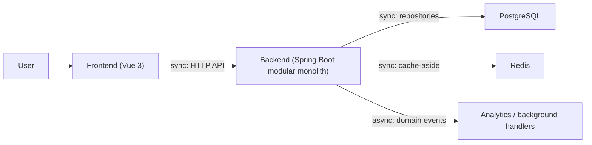
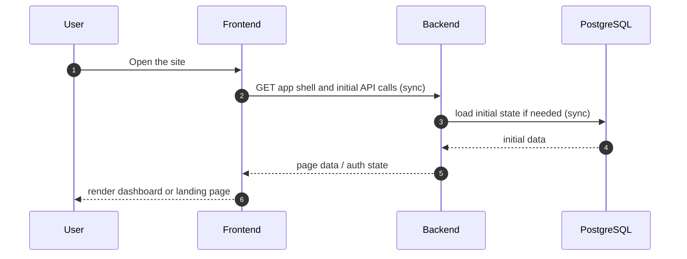
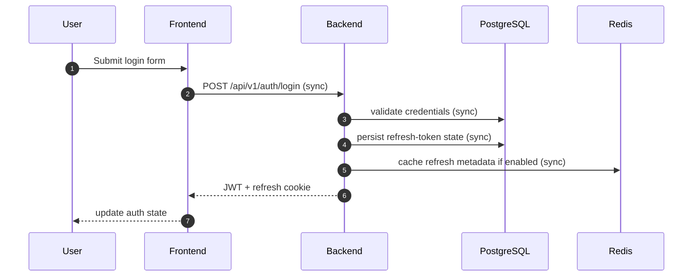
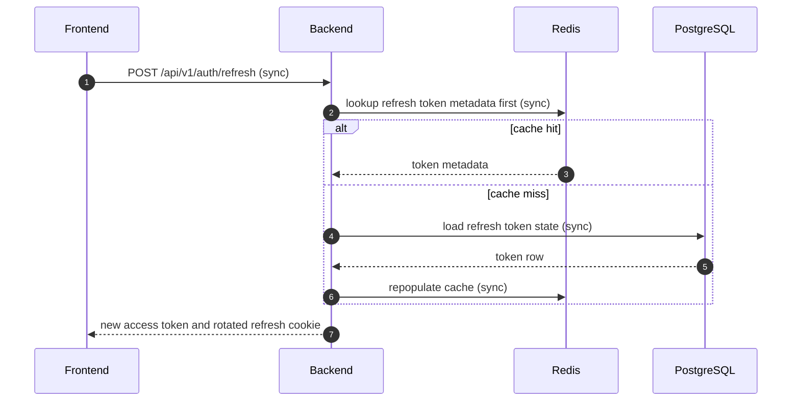
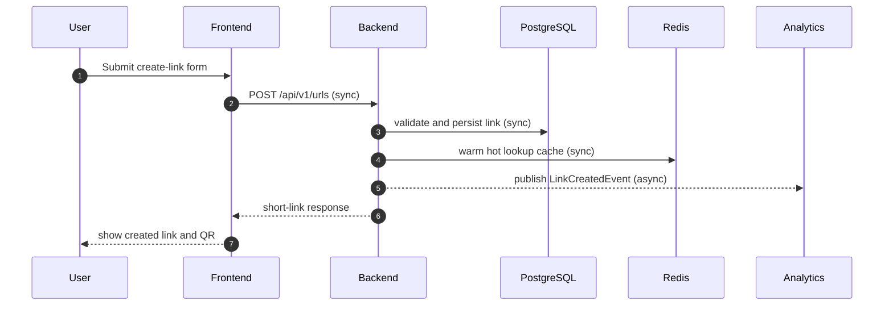
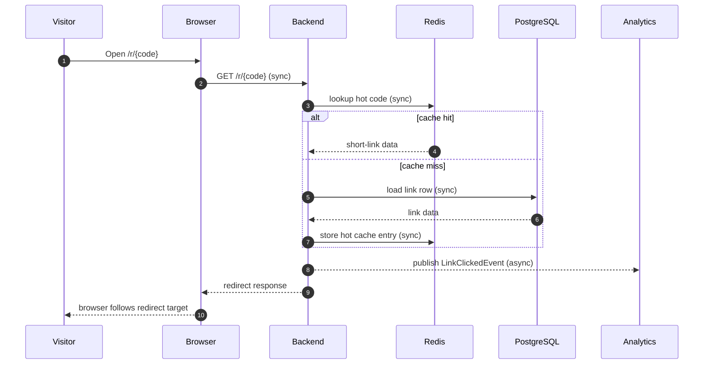
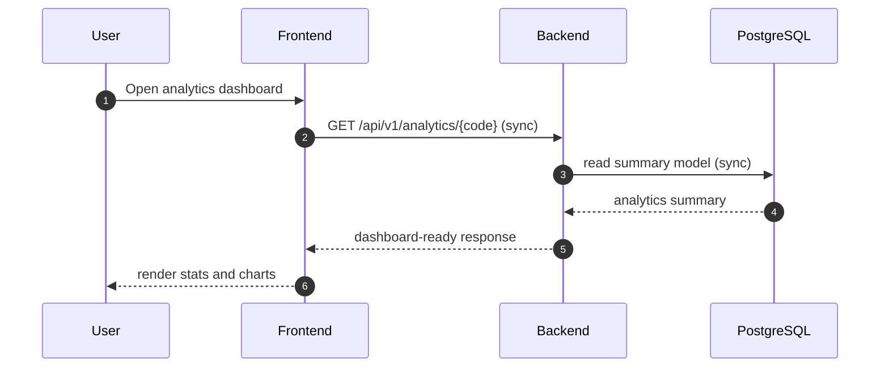

# Application Communication Map

## Purpose

This document shows how the frontend and backend work together as one application.

It complements the module communication map by showing the user-facing flows end to end.

For the Redis/cache breakdown behind those flows, see [cache-redis-scenarios.md](cache-redis-scenarios.md).

## High-Level View

Legend:

- `sync` means the caller waits for the response.
- `async` means the backend publishes an event and continues without waiting for the consumer.

## Responsibilities By Layer

### Frontend

- renders the public app shell
- handles form input and validation
- calls backend HTTP APIs
- stores only non-sensitive UI state
- reacts to auth state and role-aware navigation

### Backend

- owns business rules
- validates and persists data
- issues auth tokens and cookies
- handles redirects and analytics events
- serves admin and monitoring endpoints

### Database And Cache

- PostgreSQL is the durable store
- Redis is the fast path for hot lookups and counters

## Main User Flows

### 1. Open the app

### 2. Sign in or refresh session

Refresh flow:

### 3. Create a short link

### 4. Open a short link

### 5. View analytics

## Frontend To Backend Contract

The frontend should only talk to backend HTTP endpoints.

It should not:

- access the database directly
- know internal backend repositories
- depend on Redis directly
- depend on backend package internals

That keeps the browser layer simple and the backend boundaries enforceable.

## Backend To Infrastructure Contract

### PostgreSQL

Used for:

- identity and refresh-token state
- links and ownership
- click events and summaries
- verification and reset tokens

### Redis

Used for:

- hot redirect lookups
- rate limiting counters
- optional refresh-token lookup acceleration

### Events

Used for:

- link creation notifications
- click analytics fan-out
- future background jobs that do not need to block the user

## Sync Vs Async Summary

### Synchronous

- browser to backend HTTP calls
- backend service calls
- repository reads and writes
- cache reads and writes
- login, refresh, logout, create-link, redirect, and analytics read paths

### Asynchronous

- link-created events to analytics
- link-clicked events to analytics
- future background processing that should not block the request path

## Practical Rule Of Thumb

- If the user is waiting on the response, the flow is synchronous.
- If the backend publishes a domain event for a later consumer, the flow is asynchronous.
- If the data must survive restarts, keep it in PostgreSQL.
- If the data only speeds up hot paths, keep it in Redis.
