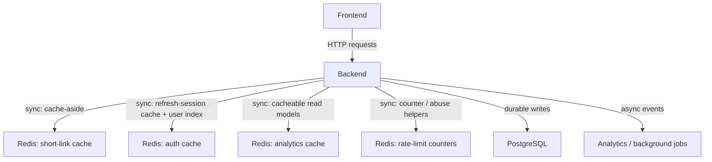
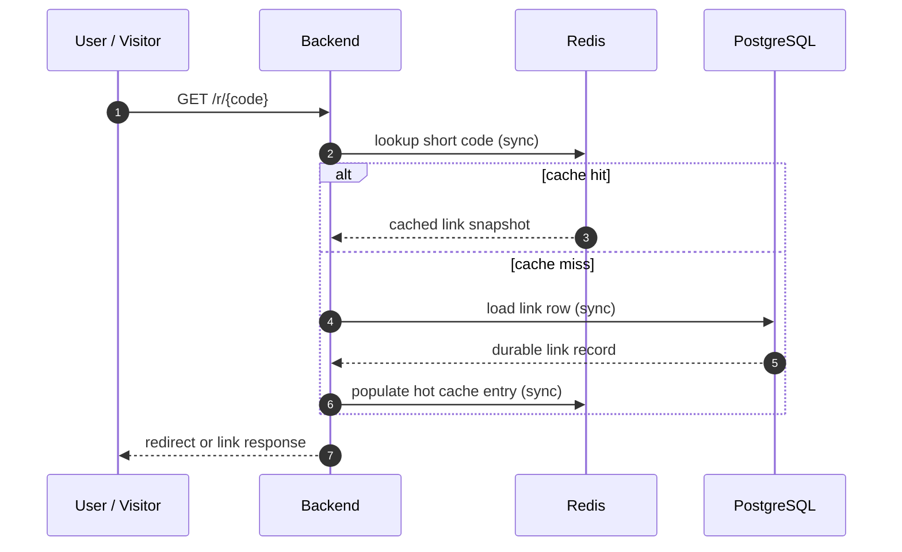
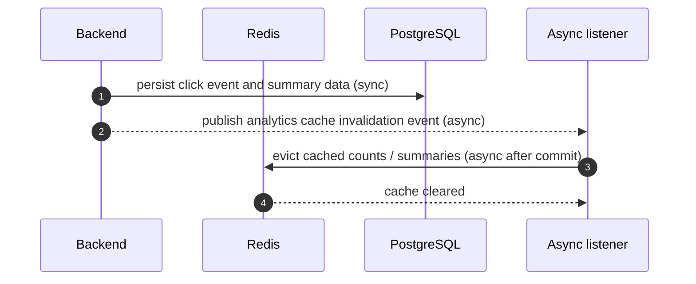
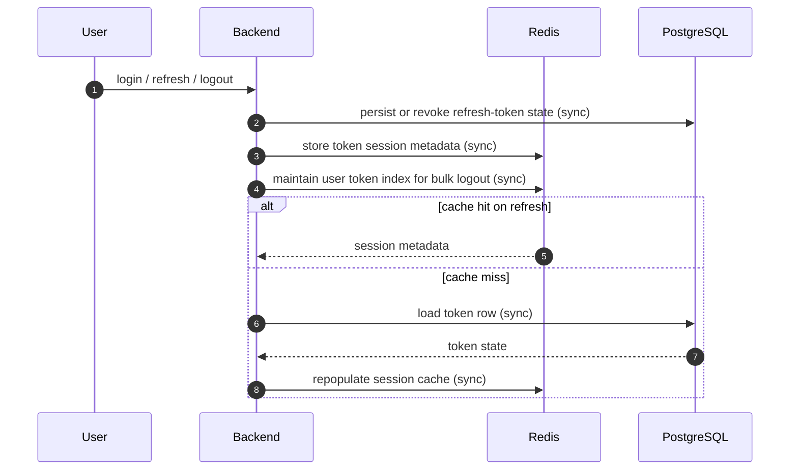
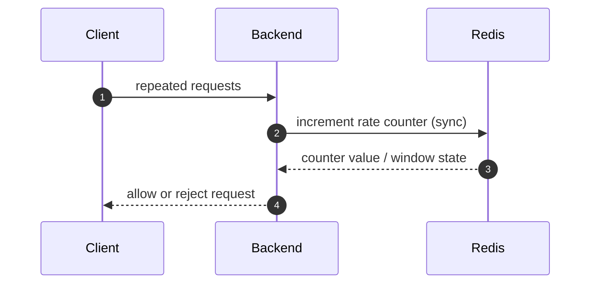

# Redis And Cache Scenarios

## Purpose

This document groups the Redis and cache-related flows in WebLinkPilot in one place.

The goal is to make it obvious which data is cached, which data remains durable in PostgreSQL, and where the app uses synchronous cache access versus asynchronous invalidation or background work.

## At A Glance

## Redis Responsibilities

Redis is used as a fast path and a coordination helper, not as the system of record.

### Redis stores

- hot short-link lookups
- refresh-token session metadata
- refresh-token user index for bulk logout
- analytics read caches
- rate-limiting counters when enabled

### PostgreSQL stores

- users, roles, and social identities
- durable refresh-token state
- short links and ownership
- click events and analytics summaries
- verification and reset tokens

## Short-Link Cache Flow

What is cached:

- short code
- target URL
- owner and expiry snapshot
- redirect metadata needed for the hot path

What invalidates it:

- create
- update
- delete
- expiration cleanup

## Analytics Cache Flow

What is cached:

- analytics counts
- analytics summaries

What invalidates it:

- new clicks
- new summary state
- changes that affect a link's reporting view

The invalidation now happens after the transaction commits, through an async listener, so the recorder no longer waits on Redis.

## Auth Refresh-Token Cache Flow

Current auth cache layout:

- `auth:refresh:{tokenHash}` stores refresh-session metadata
- `auth:refresh:user:{username}` stores the token-hash index for bulk logout

This makes the common paths faster:

- login caches the new session
- refresh prefers Redis before PostgreSQL
- revoke can clean up a single token quickly
- revoke-all can start from the user index when Redis is warm

## Rate-Limit Counter Flow

Redis can be used here for lightweight throttling and abuse controls because the data is short-lived and does not need to survive restarts.

## Local Versus Demo

### Local

- Redis is available in the Docker dev stack.
- Some paths can still fall back to the non-Redis profile for simpler local runs.

### Demo / deployment

- Redis is expected to be present for the deployed demo stack.
- PostgreSQL remains the durable source of truth even when Redis is unavailable.

## Sync Versus Async

### Synchronous

- cache lookups
- cache writes
- cache evictions
- refresh-token metadata updates
- rate counter increments

### Asynchronous

- analytics event fan-out after a redirect or create-link action
- analytics cache invalidation after click writes
- future cache warming jobs
- future reminders or maintenance tasks that do not need to block the request path

## Practical Rule

- If the data only makes the request faster, keep it in Redis.
- If the data must survive restarts, keep it in PostgreSQL.
- If the cache goes missing, the app should still function by falling back to the durable store.
