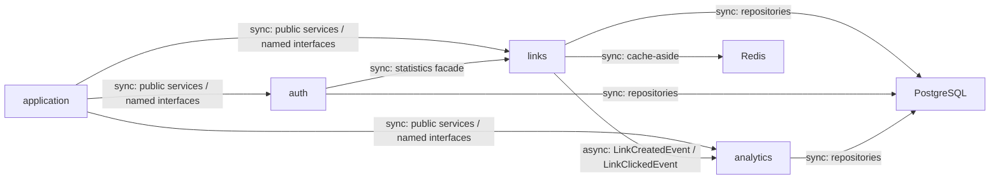
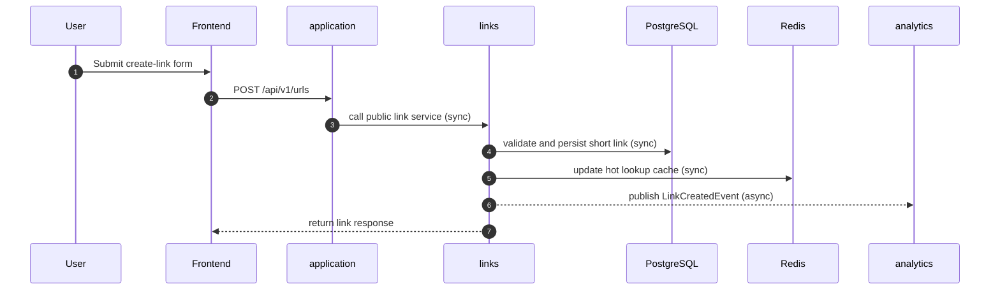
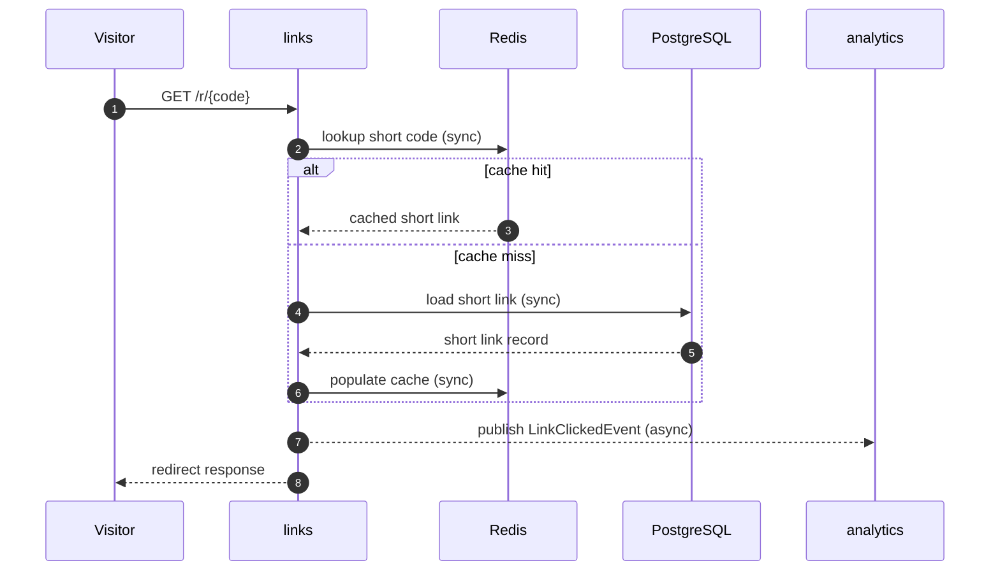
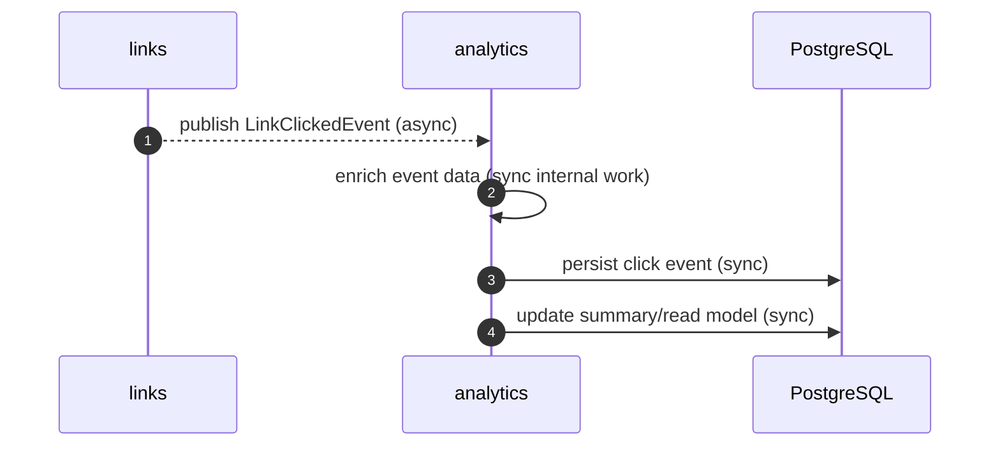
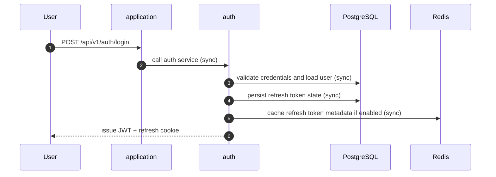
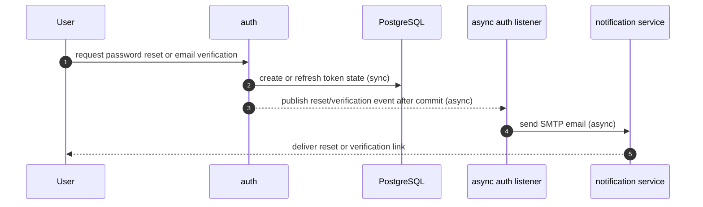

# Module Communication Map

## Purpose

This document explains how the backend modules relate to each other, how they communicate, and where the database and cache fit into the flows.

The goal is to make the modular monolith easy to reason about without turning it into a microservices architecture.

For the Redis-specific scenarios across links, auth, analytics, and rate limiting, see [cache-redis-scenarios.md](cache-redis-scenarios.md).

## Module Ownership

| Module | Owns | Notes |
|---|---|---|
| `application` | Spring Boot startup, security wiring, observability, rate limiting, bootstrap jobs | Composition root only |
| `auth` | Authentication, refresh sessions, password reset, email verification, account management, GitHub OAuth | Domain logic for identity and access |
| `links` | Short-link lifecycle, alias handling, redirects, QR, bootstrap links, cleanup, URL statistics | Domain logic for links |
| `analytics` | Click-event persistence, enrichment, and summaries | Consumes link events and serves analytics reads |
| `shared-contracts` | Shared DTOs and event contracts | Stable boundary between modules |
| `build-support` | JaCoCo aggregation and coverage reporting | Build-only, not part of runtime communication |

## Communication Rules

- `application` wires modules together but should not hold core business logic.
- `auth`, `links`, and `analytics` can expose small public services and named interfaces.
- Cross-module communication should prefer public APIs and shared contracts over repository access.
- Business events are used when the producer should not know about the consumer.
- Redis is a performance layer, not the source of truth.
- PostgreSQL is the source of truth for durable business data.

## Communication Matrix

| From | To | Mechanism | Type | Typical Data |
|---|---|---|---|---|
| `application` | `auth`, `links`, `analytics` | public services, named interfaces | Sync | bootstrap orchestration, security wiring, health/config access |
| `auth` | `links` | public statistics facade | Sync | admin link counts, ownership summary |
| `links` | `analytics` | shared event contracts + Spring application events | Async | `LinkCreatedEvent`, `LinkClickedEvent` |
| `links` | Redis | cache-aside | Sync | hot short-code lookups |
| `links` | PostgreSQL | repository layer | Sync | short links, aliases, ownership, expiration state |
| `analytics` | PostgreSQL | repository layer | Sync | click events, summary data |
| `auth` | PostgreSQL | repository layer | Sync | users, roles, refresh tokens, password reset tokens, email verification tokens |
| `auth` | Redis | optional token/session cache | Sync | fast refresh-token lookup and rotation metadata |
| `analytics` | `links` | read facade | Sync | link read model for summaries and admin views |

Legend:

- `Sync` means the caller waits for a direct response before continuing.
- `Async` means the producer publishes an event and does not wait for the consumer to finish.

## High-Level Module View

## Short-Link Creation Flow

Sync parts:

- frontend to backend request
- `application` to `links`
- `links` to PostgreSQL
- `links` to Redis

Async parts:

- `links` to `analytics` via `LinkCreatedEvent`

## Redirect Flow

Sync parts:

- redirect request to `links`
- cache lookup
- database fallback
- cache population

Async parts:

- click event publication to `analytics`

## Analytics Flow

Analytics is event-driven from the link module, but the persistence work inside `analytics` is synchronous once the event has been received.

## Auth Flow

Refresh token storage is intentionally designed as durable-first:

- PostgreSQL stores the source of truth
- Redis can cache refresh-token lookup metadata for speed
- the API still behaves synchronously for login and refresh calls

## Auth Email Side Effects

Sync parts:

- request validation
- token issuance and durable persistence
- event publication after commit

Async parts:

- SMTP delivery through the listener
- any future retry / failure handling around outbound mail

## Cache And Database Responsibilities

### PostgreSQL

Use PostgreSQL for:

- durable users and roles
- durable refresh-token state
- short-link data
- analytics events and summaries
- password reset and email verification tokens

### Redis

Use Redis for:

- hot short-code lookups
- rate limiting counters
- optional refresh-token lookup acceleration

Redis should never be treated as the only copy of durable auth or link data.

## What Is Synchronous And What Is Asynchronous

### Synchronous

- HTTP requests from the frontend to the backend
- service calls inside `application`
- repository calls to PostgreSQL
- cache reads and writes to Redis
- read facades between modules
- auth login, refresh, logout, reset, and profile requests

### Asynchronous

- `links` publishing click and creation events
- `analytics` consuming those events
- future background processing that does not belong on the request path

## Practical Takeaway

- `application` orchestrates.
- `auth` owns identity.
- `links` owns short-link behavior and redirects.
- `analytics` owns click processing and reporting.
- `shared-contracts` keeps the boundary types stable.
- PostgreSQL is the durable store.
- Redis is the fast path.
- events connect modules asynchronously when direct coupling would be worse.
