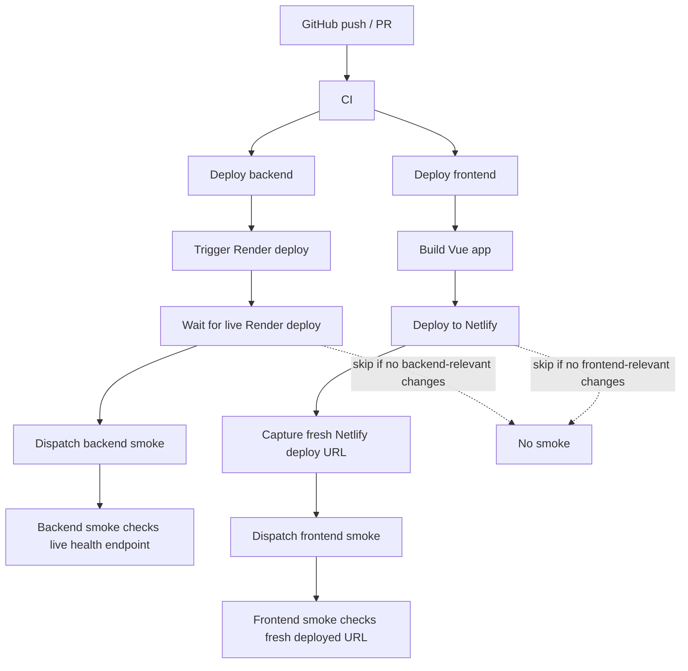

# Deployment

## Chosen live-demo path

- frontend: Netlify
- backend: Render
- database: Render Postgres
- cache: Render Key Value (Redis)

## Architecture

The demo deployment is split into four layers:

1. GitHub Actions validates the code on push and pull request.
2. The backend deploy workflow triggers Render, waits for the new deploy to become live, then dispatches backend smoke.
3. The frontend deploy workflow builds the Vue app, publishes it to Netlify, captures the fresh deploy URL, then dispatches frontend smoke for that exact URL.
4. The smoke workflows run against live demo infrastructure, not against the skipped deploy path.

Important behavior:

- if a backend-only commit lands, the frontend deploy workflow skips and does not dispatch frontend smoke
- if a frontend-only commit lands, the backend deploy workflow skips and does not dispatch backend smoke
- if a deploy workflow skips because nothing relevant changed, no smoke job should start
- smoke uses the freshly deployed backend or frontend target, not the previous stable alias

### Flow diagram

## Current state

| Area                     | Status | Notes                                                                                                                                                                                                                                                                                                             |
| ------------------------ | ------ | ----------------------------------------------------------------------------------------------------------------------------------------------------------------------------------------------------------------------------------------------------------------------------------------------------------------- |
| Backend CI               | Done   | GitHub Actions runs Maven and frontend validation on push and PR.                                                                                                                                                                                                                                                 |
| Backend deploy workflow  | Done   | GitHub Actions triggers the Render deploy hook after CI succeeds on `main`.                                                                                                                                                                                                                                       |
| Backend readiness gate   | Done   | The backend deploy workflow waits for the new Render deploy to become live before it dispatches backend smoke.                                                                                                                                                                                                    |
| Frontend deploy workflow | Done   | GitHub Actions builds the Vue app and deploys it to Netlify.                                                                                                                                                                                                                                                      |
| Deployment smoke tests   | Done   | GitHub Actions checks the live backend health endpoint and the freshly deployed frontend URL after deploys with separate backend and frontend smoke workflows. Backend smoke is dispatched only after a real backend deploy finishes, and frontend smoke uses the Netlify deploy URL returned by the deploy step. |
| Render runtime           | Done   | The backend runs on Render with Postgres and the demo profile.                                                                                                                                                                                                                                                    |
| Redis cache              | Next   | Add a Render Key Value instance and point the demo profile at its internal Redis URL.                                                                                                                                                                                                                             |
| Frontend host config     | Done   | Netlify site secrets and the backend API URL are configured.                                                                                                                                                                                                                                                      |
| Backend public URL       | Done   | The backend is reachable over HTTPS from the browser.                                                                                                                                                                                                                                                             |
| CORS origin              | Done   | The exact Netlify origin is allowed by the backend CORS config.                                                                                                                                                                                                                                                   |
| Monitoring               | Done   | The admin page now links to backend health/info/metrics/prometheus, and Prometheus/Grafana are available in a separate optional monitoring stack.                                                                                                                                                                 |

## GitHub Actions workflows

- CI: [`.github/workflows/ci.yml`](/C:/Users/dev/Desktop/weblink-pilot/.github/workflows/ci.yml)
- Render deploy: [`.github/workflows/deploy-backend.yml`](/C:/Users/dev/Desktop/weblink-pilot/.github/workflows/deploy-backend.yml)
- Netlify deploy: [`.github/workflows/deploy-frontend.yml`](/C:/Users/dev/Desktop/weblink-pilot/.github/workflows/deploy-frontend.yml)
- Deployment smoke backend: [`.github/workflows/smoke-backend.yml`](/C:/Users/dev/Desktop/weblink-pilot/.github/workflows/smoke-backend.yml)
- Deployment smoke frontend: [`.github/workflows/smoke-frontend.yml`](/C:/Users/dev/Desktop/weblink-pilot/.github/workflows/smoke-frontend.yml)

## Setup

### 1. GitHub repository setup

Use the repository `Settings` pages for secrets, variables, and the `demo` environment.

Create the `demo` environment first, then add secrets and variables there so the deploy and smoke workflows can read them.

Recommended GitHub values:

- repository secret `RENDER_DEPLOY_HOOK_URL`
- repository secret `RENDER_API_KEY`
- repository environment variable `RENDER_BACKEND_SERVICE_ID`
- repository secret `NETLIFY_AUTH_TOKEN`
- repository secret `NETLIFY_SITE_ID`
- repository secret `VITE_API_BASE_URL`
- optional repository/environment variable `VITE_CLOUDFLARE_WEB_ANALYTICS_TOKEN`
- repository environment variable `RENDER_HEALTH_URL`
- repository environment variable `FRONTEND_SMOKE_URL`

Use the `demo` environment for the values that should only exist in the live demo pipeline.
The workflows already read `vars.*` first and fall back to `secrets.*` where appropriate.

### 2. Netlify setup

Create or connect the frontend site in Netlify.

Set:

- build command: `npm run build`
- publish directory: `dist`
- site token: store as `NETLIFY_AUTH_TOKEN` in GitHub
- site ID: store as `NETLIFY_SITE_ID` in GitHub
- public backend URL: store as `VITE_API_BASE_URL` in GitHub, for example `https://weblink-pilot.onrender.com/api/v1`
- optional Cloudflare Web Analytics token: store as `VITE_CLOUDFLARE_WEB_ANALYTICS_TOKEN` in the `demo` environment if you want live demo traffic analytics

The frontend workflow uses the Netlify CLI to deploy the built `dist` folder and reads the fresh deploy URL from the deploy output.
That URL is then passed to frontend smoke so the smoke job checks the exact fresh deploy.

### 2.1 Cloudflare Web Analytics for the demo frontend

The frontend build can inject the Cloudflare Web Analytics beacon into `index.html`.
This is disabled by default and only turns on when `VITE_CLOUDFLARE_WEB_ANALYTICS_TOKEN` is present at build time.

Setup:

1. In Cloudflare, open **Web Analytics** and add the Netlify demo hostname.
2. Copy the site token from the Cloudflare JavaScript snippet.
3. Add that token as `VITE_CLOUDFLARE_WEB_ANALYTICS_TOKEN` in the GitHub `demo` environment or repository secrets.
4. Redeploy the frontend.
5. Confirm the built page includes `https://static.cloudflareinsights.com/beacon.min.js`.
6. Wait a few minutes for visits to appear in the Cloudflare Web Analytics dashboard.

Local/dev behavior:

- `frontend/.env.example` leaves `VITE_CLOUDFLARE_WEB_ANALYTICS_TOKEN` blank.
- When the token is blank, Vite does not inject the Cloudflare script.
- Local and Docker dev remain lightweight and do not call Cloudflare.

What it measures:

- page views and visitors for the public frontend
- referrers and basic page usage
- SPA route changes through Cloudflare's History API support

Privacy note:

- Cloudflare describes Web Analytics as privacy-first and says it does not collect or use visitors' personal data.
- The demo uses this only for public site traffic analytics; product link analytics still come from the WeblinkPilot backend.
- Reference docs: [Cloudflare Web Analytics setup](https://developers.cloudflare.com/web-analytics/get-started/) and [Cloudflare SPA support](https://developers.cloudflare.com/web-analytics/get-started/web-analytics-spa/).

### 3. Render setup

Create these Render resources:

- one Web Service for the backend
- one Postgres instance
- one Key Value instance for Redis

Set backend env vars in Render:

- `SPRING_PROFILES_ACTIVE=demo`
- `JWT_SECRET=<long random secret>` or `APP_AUTH_JWT_SECRET=<long random secret>`
- `SPRING_DATASOURCE_URL=jdbc:postgresql://<render-postgres-host>:5432/<database>`
- `SPRING_DATASOURCE_USERNAME=<database-user>`
- `SPRING_DATASOURCE_PASSWORD=<database-password>`
- `REDIS_URL=<render-key-value-internal-url>`
- `BOOTSTRAP_ADMIN_USERNAME=<admin-username>`
- `BOOTSTRAP_ADMIN_PASSWORD=<admin-password>`
- `BOOTSTRAP_ADMIN_ROLE=ADMIN`
- `BOOTSTRAP_USER_USERNAME=<user-username>`
- `BOOTSTRAP_USER_PASSWORD=<user-password>`
- `APP_CORS_ALLOWED_ORIGIN_PATTERNS=https://weblink-pilot.netlify.app`
- `SPRING_MAIL_HOST=smtp-relay.brevo.com`
- `SPRING_MAIL_PORT=587`
- `SPRING_MAIL_USERNAME=<brevo-smtp-username>`
- `SPRING_MAIL_PASSWORD=<brevo-smtp-password>`
- `SPRING_MAIL_SMTP_AUTH=true`
- `SPRING_MAIL_SMTP_STARTTLS=true`
- `SPRING_MAIL_FROM_ADDRESS=<brevo-verified-sender>`
- `SPRING_MAIL_FROM_NAME=WeblinkPilot`
- `APP_AUTH_MAIL_DELIVERY_MODE=SMTP`

Where to get the missing values:

- `SPRING_MAIL_USERNAME` and `SPRING_MAIL_PASSWORD` come from Brevo's SMTP settings page for your sender or SMTP key.
- `SPRING_MAIL_FROM_ADDRESS` must be a sender address or domain that Brevo accepts for that account.
- `GITHUB_CLIENT_ID` and `GITHUB_CLIENT_SECRET` come from GitHub `Settings -> Developer settings -> OAuth Apps` after you create the OAuth app for WeblinkPilot.

Optional:

- `APP_PUBLIC_BASE_URL=https://weblink-pilot.onrender.com`

The backend deploy workflow uses:

- `RENDER_DEPLOY_HOOK_URL` to trigger a new Render deploy
- `RENDER_API_KEY` and `RENDER_BACKEND_SERVICE_ID` to verify the new deploy is actually live before backend smoke starts

## Smoke and keep-alive

If you use Render free and want to reduce cold starts, add GitHub repository variables:

- `RENDER_HEALTH_URL=https://<your-render-backend>/actuator/health`
- `FRONTEND_SMOKE_URL=https://<your-netlify-site>/`

Then let the scheduled GitHub workflow ping those URLs every 5 minutes.

If you store either URL in the `demo` environment instead, the deployment smoke and ping workflows will pick them up from that environment too.
For local manual smoke runs, the helper script also reads those values from `infra/.env` automatically.
The smoke output prints the backend HTTP status plus `status=UP`, and the frontend HTTP status plus the app shell marker (`id="app"`). By default, the helper script checks the local Docker stack; set `SMOKE_TARGET=demo` together with `RENDER_HEALTH_URL` and `FRONTEND_SMOKE_URL` to smoke the live demo instead. The PowerShell and Bash scripts also add spacing, color, and start/end banners so the backend and frontend checks are easy to scan separately.

## Important note

The Netlify frontend needs a backend URL that is reachable from the browser.
For a live demo, HTTPS is strongly recommended for the backend endpoint.
The deployed backend should run with `SPRING_PROFILES_ACTIVE=demo` so it picks up PostgreSQL, public URL, CORS, and SMTP settings from `application-demo.yml`.
The demo profile keeps the mail health indicator disabled so the `/actuator/health` endpoint stays responsive even if the external SMTP provider is slow or temporarily unreachable.

If you use Render's default service URL, `APP_PUBLIC_BASE_URL` can be omitted because the backend falls back to `RENDER_EXTERNAL_URL`.

## Security and observability defaults

The backend sends these browser-facing security headers from the Spring Security configuration:

| Header | Current value | Why it exists |
| ------ | ------------- | ------------- |
| `Content-Security-Policy` | `default-src 'self'; base-uri 'self'; object-src 'none'; frame-ancestors 'none'; img-src 'self' data: https:; font-src 'self' data:; style-src 'self' 'unsafe-inline'; script-src 'self'; connect-src 'self' http://localhost:* http://127.0.0.1:* https:` | Reduces XSS impact, blocks plugin/object content, blocks framing, and limits where scripts, images, fonts, and API calls can load from. |
| `Referrer-Policy` | `same-origin` | Avoids leaking full cross-site referrer paths while keeping same-origin navigation context. |
| `Permissions-Policy` | `camera=(), microphone=(), geolocation=(), payment=()` | Disables browser features the app does not need. |
| `X-Frame-Options` | `SAMEORIGIN` | Adds legacy clickjacking protection alongside `frame-ancestors`. |

Operational endpoints use this deployment model:

| Environment | Recommended value | Result |
| ----------- | ----------------- | ------ |
| Local direct development | `APP_SECURITY_PUBLIC_OBSERVABILITY=true` through the `local` profile default | Prometheus-style metrics can be opened locally without an admin token. |
| Docker dev stack | `APP_SECURITY_PUBLIC_OBSERVABILITY=true` through the `dev` profile default | The local Prometheus container can scrape `/actuator/prometheus`. |
| Demo / Render | `APP_SECURITY_PUBLIC_OBSERVABILITY=false` or unset | `/actuator/health` and `/actuator/info` stay public; `/actuator/metrics` and `/actuator/prometheus` require admin access. |
| Production-style deployments | `APP_SECURITY_PUBLIC_OBSERVABILITY=false` or unset | Metrics are not public unless you deliberately place them behind a private network or separate observability gateway. |

Do not set `APP_SECURITY_PUBLIC_OBSERVABILITY=true` in the public demo unless you have another protection layer in front of actuator metrics.
The admin monitoring UI still uses `/api/v1/admin/monitoring`, which is protected by the admin role.

## Runbook

1. push to `main` or run the CI workflow
2. let the backend deploy workflow trigger the Render redeploy
3. let the frontend deploy workflow publish the Vue app to Netlify
4. let the backend smoke workflow run only after the backend deploy workflow has confirmed a live Render deploy
5. let the frontend smoke workflow run only after the frontend deploy workflow has completed a real Netlify deploy and returned the deploy URL
6. open the live site and verify create-link, redirect, analytics, and QR flows
